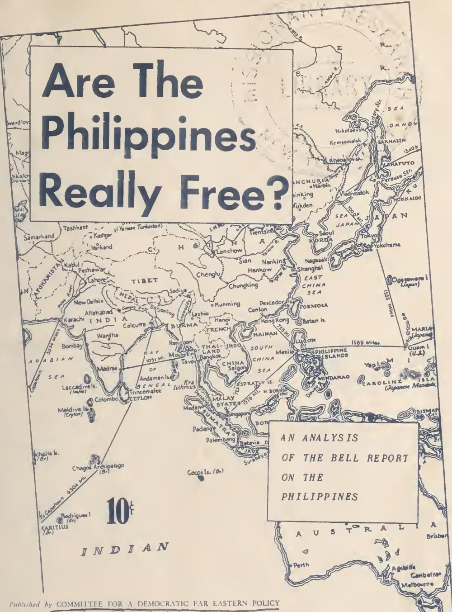

{0}------------------------------------------------

# Are The Philippines Really Free?

AN ANALYSIS  
OF THE BELL REPORT  
ON THE  
PHILIPPINES

10%  
INDIAN

Published by COMMITTEE FOR A DEMOCRATIC FAR EASTERN POLICY  
80 East 11th Street, New York 3, N. Y.

Distances are in statute miles

{1}------------------------------------------------

# Can Colonialism Reform?

The principal ingredient of United States Far Eastern policy is military force for suppression of genuine reform and independence movements. But influential circles in the United States realize that all their military might is insufficient to enslave a billion people. The leading spokesman of this group in 1950, Secretary of State Dean Acheson, repeatedly admitted in his speeches that the revolutionary movements in the Far East have a material basis in the starvation of the population, the land hunger of the peasantry, and the revolt against exploitation by western interests. Mr. Acheson has urged the United States Government to promise relief to the people of Asia in order to split or divert the anti-imperialist movement, which he falsely calls "Soviet aggression."

Such attempts are secondary to the use of military force. They operate side-by-side with military intervention. Yet they are essential for imperialism. If they fail, imperialism will fall in the Far East.

President Truman's Point Four Program was in part the general expression of this approach. The Bell Report (Report of the U.S. Economic Survey Mission to the Philippines, dated October 9, 1950) may be regarded as a detailed attempt to document such an economic reform program in Asia (comparable documents preceded the Marshall Plan in Europe.)

By virtue of its detail, the Report permits exposure of the fraudulent character of its proposals, and of the contradictions which make it impossible to moderate the suffering imposed by imperialist domination of weaker countries, while maintaining and extending the system of domination.

The Report admits that economic conditions in the Philippines are "unsatisfactory", and "deteriorating"; that agricultural and industrial production are still below prewar, while the population has increased twenty-five per cent; that "the inequalities of income in the Philippines, always large, have become even greater during the past few years"; that "real wages in agriculture are lower than before the war", and for many agricultural workers, "wholly inadequate"; that government finances have reached the critical point, with school teachers going without pay in some areas; that receipts from exports are largely "dissipated in imports of luxury and non-essential goods, in the remittance of profits", and in the flight of Philippine capital abroad.

The Report groups its proposals into seven recommendations.

## 1. Government Finance

Government deficits contribute to the inflationary rise in the cost of living, which adds to the poverty of the Philippine people. The Report recommends higher taxes to cope with this. It notes that the present tax system is "heavily weighted against those with low incomes", and urges that "the tax structure be revised to increase the proportion of taxes collected from high incomes and large property holdings".

The authors of the report could not, if they would, accomplish similar tax reform in the United States, where the burden on working people is being rapidly increased in connection with the present war

{2}------------------------------------------------

mobilization. The wealthy classes placed in power in the Philippines by the United States Government are not going to shift the tax burden from workers and peasants to themselves any more than their Wall Street masters do in the United States.

Actually, the general talk in the Report about shifting the tax burden is mere camouflage. When it gets down to brass tacks, it proposes to make the tax burden on the poor still heavier. The specific proposal is to increase excise and sales taxes by 88 million pesos; income and estate taxes by 23 million pesos (the remaining 40 million proposed would have a mixed or uncertain impact). Furthermore, part of the increase in income taxes is to be obtained by lowering the individual exemptions. Thus the Bell Report proposes to get four times as much additional taxes from the poor as from the wealthy. Since only a proportion of the 20 million increase in income taxes would be in corporations taxes, the effect on the United States corporations operating in the Philippines would be virtually nil.

The Report proposes to hold down government expenditures. It discusses the three major items in the budget, explaining that the education budget cannot be cut because it is inadequate, that the expenditures for the military and police may have to be increased, while the expenditure for economic development probably can be reduced "as an emergency measure". Then the report talks of increasing expenditures for public health, education, agriculture, and various types of public works, but does not say where the funds would come from, since it proposes just enough taxes to balance the budget at present levels of expenditure.

## 2. Agriculture

The Report notes the intolerable conditions of the peasantry, the great bulk of the population:

"On top is the landlord, who often exacts an unjust share of the crop in spite of ineffective legal restrictions to the contrary... The farmer cannot see any avenue of escape. He has no credit except at usurer's rates. There is no counsel to whom he can turn with confidence."

Landowners use their high profits to buy up more land, so that: "land ownership by farmers who work the land has steadily declined... The land problem remains the same or worse than four years ago." And, the Report notes, the Government shows no disposition to do anything about it.

So, the Report recommends "land reform". Surely, genuine land reform is the most crucial single measure in a predominantly agrarian country like the Philippines. But it cannot be accomplished in the present framework. Without the landlords, the Philippine Government and the privileged position of United States corporations and military forces in the Philippines would collapse. The landlords serve Wall Street interests in order to keep their land, not in order to give it up. The authors of the Bell Report might as well try to get the southern landowners in the United States to give up their land to Negro and white sharecroppers -- they would be lucky to escape prosecution for attempting to overthrow the Government by force and violence if they even suggested such a reform here.

But the Bell Report type of "land reform" is harmless enough. It proposes that the Philippine Government buy land from landlords and resell it in small holdings and on generous terms to those who till the soil. Will the landlords be willing to sell any but their worst land? Will they not demand so large a price that the new "owners" will be in effect paying more rent than before as payments on the mortgage? How is the Government going to buy up land on a substantial scale if it has to curtail expenditures, especially for economic development?

{3}------------------------------------------------

In the Philippines, as in other colonies, the rulers weakened the existing small-scale handicraft industry, and deliberately prevented the development of an independent modern industry. The United States Government codified the unbalanced character of Philippine economy by linking "independence" to the Philippine Trade Act. This Act prohibits protective tariffs against United States goods until 1954, and then permits only gradually increasing tariffs for the next twenty years. It contains a "parity provision", and a "non-discrimination" provision, which the Report admits hamper the Philippine economy, besides placing "a limitation on Philippine sovereign rights".

According to the Report, only 78,000 workers were engaged in manufacturing industries proper in 1938, and there has been little or no improvement since. Also, a wide variety of goods are imported which could easily be produced with local raw materials. There is no basic industry. Wartime destruction has not yet been adequately restored, and there has been no diversification or increase in capacity.

If the authors of the Bell Report really had industrial diversification in mind, they would begin by urging repeal of the Philippine Trade Act, and all other pressures which prevent the expulsion of Wall Street control over the Philippine economy. In the absence of any such recommendation, the talk of "diversification" is empty verbiage. A recent United Nations report: World Iron Ore Resources and Their Utilization shows that the Philippines have the resources, in conjunction with other Asian countries, for construction of efficient steel mills at Manila and Surigao. But the Bell Report deals with no such practical possibilities. Instead, it specifically excludes any basic or large-scale industry. It talks only of the extension of existing-type small-scale light industries and handicraft production, and advances no practical measures to make this possible.

But the Bell Report means business for one kind of diversification:

"Prompt consideration should be given to the development of production of various strategic minerals for which the United States provides an exceptionally favorable market. For this purpose, discussions should be held by the representatives of the Philippine Government with the appropriate procurement authorities of the United States Government."

### 4. Balance of Payments

Since obtaining "independence" the net reserves (gold and equivalent) of the Philippines declined from \$647 million at the end of 1745 to \$260 million at the end of 1949. This means that the country's international trade and other payments are unbalanced, so that all the wealth of the country is drained away. The Report mentions various reasons for this. One is the use of foreign exchange to buy luxuries and non-essential goods. Another, more fundamental, is the "large outflow of private remittances". What are these "remittances"? "Re-payment of funds borrowed abroad by foreign enterprises, the transfer of profits and depreciation reserves by foreign enterprises, the transfer of profits and depreciation reserves by foreign enterprises, and the outflow of domestic funds". In short, the remittances are the various forms of profits taken by the United States companies that run the Philippine economy, plus the taking out of capital by wealthy Filipinos who do not think they can maintain power much longer.

The Report shows that the annual "take" from the Philippines increased from \$33 million per year in 1938-40 to \$108 million in 1949 (including \$16 million under the item "errors and omissions" which generally consists of hidden outpayments of profits). This 1949 profit is equivalent in Philippine currency to 216 million pesos. It excludes the excessive freight and insurance charges by American shipping and finance companies on imports into the Philippines. According

{4}------------------------------------------------

to the Balance of Payments Yearbook of the International Monetary Fund these charges have been increasing rapidly, and by 1949 amounted to 175 million pesos, or a 15 per cent addition to the cost of imported goods.

Adding these charges to profits previously mentioned shows that the total Wall Street toll from the Philippines in 1949 amounted to 381 million pesos. This still excludes a hidden profit, of unknown dimensions, resulting from the practice admitted in the report of charging the Philippines more than normal prices for goods sold them and paying the Philippines less than normal prices for goods bought from them.

The known toll of 381 million pesos amounts to 11 per cent of the total 1949 commodity production of the Philippine Republic. It amounts to 73 per cent of the value of Philippine exports in 1949. In other words, of the value of goods exported, only 27 per cent remained in the Philippines, the remainder went to pay various forms of profit to United States corporations.

What to do about it? "Exchange controls should be gradually relaxed to permit the transfer of all current earnings and moderate repatriation of capital" -- in other words, make it still easier for United States companies to extract profits from the Philippines. Also, the Report recommends that a Treaty of Friendship, Commerce, and Navigation should be negotiated, to replace the present Trade Agreement. This could only be to put firmer teeth into the provisions of the Philippine Trade Act which undermine the sovereignty of the country. Thus the Report again would "reform" colonial type relations by making them more onerous to the Philippines.

## 5. Reforms

Various social problems are discussed, among them education, wages, and labor unions. The Report admits the deterioration of educational standards, and the growing conversion of schools to a monopoly of the wealthy. But the Report does not propose the expenditure of more Philippine Government funds to cope with this situation. Instead it suggests that local governments increase their school expenditures. Of course, this is just a pious wish. Left to the local governments, the schools will continue to deteriorate.

The Report proposes minimum wages for agricultural workers of 2 pesos per day (\$1 at the official rate of exchange, barely half that at the realistic rate). This is a modest enough increase over the 1949 average agricultural wage of 1.73 pesos per day. More important, the experience of Latin American countries shows that minimum wage and other "advanced" labor legislation in countries without any real democracy, and with the rural areas dominated by big landlords, is not worth the paper it is written on.

The Report urges recognition of the right of workers to organize free trade unions. One can imagine the kind of "free trade unions" that would be permitted among farm workers by the semi-feudal landlords kept in power by the United States Government; or among Filipino mining and crop-processing workers employed by corporations which have imposed the Taft-Hartley Act on the workers of the United States.

In the Philippines the really free labor unions have been outlawed as "Communist". The Report admits that the legal labor unions are racketeering outfits. In Manila, it states, barely one-half of the money paid as wages for stevedoring actually gets to the workers, the rest going to the Capataz, a labor boss, and his cronies. The Report recommends a "strong, free trade union movement"..."not subject to domination by government, interference by management, or racketeering by labor leaders", and "free from Communist domination". To achieve this: "A good means of developing responsibility and of eliminating Communist influence in Philippine labor organization would be to have a small group of capable American trade unionists to help and

{5}------------------------------------------------

advise Philippine trade unions. (pp 92-93). Similar American trade unionists have carried on for many years splitting Latin American trade unions in the name of "eliminating Communists", and in more recent years have carried out the same manoeuvre in western Europe. In all areas where this method is used, the real wages of workers decline.

Perhaps what is involved here is indicated by the Report mentioning with approval the fact that the U.S. Army cut its costs in half by requiring the stevedoring company to pay wages directly to the workers. In other words, labor union "reform" permits the employer to get all of the profits out of the workers, without being compelled to split with racketeers who keep them disorganized, without an extra cent going to the workers.

## 6. Public Administration

The Report talks of corruption and graft, of inefficiency and overlapping in government agencies, of laxness in collecting taxes, of the inadequate salaries of civil servants. The irony of these charges did not pass unnoticed by Philippine President Elpidio Quirino, coming as they did in the midst of a whole series of exposes of government corruption in the United States. A statement issued from the Malacanan Palace in Manila lashed back at the Washington critics, charging that the Filipinos were "pikers" at graft, compared with their mentors in the States. Indeed, in the United States bribery and corruption in the formal sense, large as they are, are secondary to the multibillion dollar legal looting of the population by big business through war orders and allied operations. In a semi-colonial country like the Philippines, direct bribery plays a more important role as a major means by which imperialism wins the support of government officials, buys traitors to the cause of true national independence, and in general creates even the narrowest basis of social support without which imperialist rule could not be maintained.

The practical proposals advanced offer no cure, but merely a tighter colonial grip on the Philippine Government by Washington. The Report urges that "the Philippine Government remove barriers to the employment of foreign technicians". Since there are already more professional people than jobs for them in the Philippines, a substantial influx of Americans in these jobs would make the future even more bleak for trained Filipinos. Also it would increase the foreign controls on the Philippine economy. The report also proposes that the Philippine government accept the services of a U.S. Technical Mission, "competent not merely to give general advice, but also to assist Philippine officials in the actual day-to-day operations and in the formulation and implementation of changes in policy which must be brought about". "It must be staffed adequately", and should operate for a five year period. The proposed range of its operations is indicated by the suggested titles of the top officials: "Coordinator of Administrative Services, Coordinator of Agricultural Development, Coordinator of Industrial Development, Coordinator of Finances, Coordinator of Labor and Social Welfare". (page 100). In short, the Philippine Government would be run in the same fashion as the Greek Government is.

## 7. United States Aid

The Report unconsciously helps shatter the myth of a generous Uncle Sam helping the new Philippine Republic to get on its financial feet. Concerning the record of United States financial aid, it says:

"The aggregate amount of United States Government disbursements and aid from 1945 to 1949 amounted to about \$1.4 billion. Most of these disbursements cannot be regarded as aid in any real sense. While they provided dollar resources for the Philippine economy which could be used to financy imports, the greater part of these disbursements were in payment for services performed for the United States. This is clearly the case for the current expenditures of the United States Army. It is equally true of the payments made by the United States to Philippine veterans of the war." (page 102).

{6}------------------------------------------------

Similarly, the report reveals that the disposal of surplus property led merely to huge profits, banked in the United States (whether by Filipino or American citizens is not made clear). "Large blocks were exported", "the Philippine economy did not secure the intended increment of machinery and equipment represented by the great stock of surplus property".

The main form of genuine aid claimed in the report is war damage payments. Billions of dollars of damage were done, much of it unnecessarily by United States bombers and artillery during the liberation of the Islands. The Report speaks of capital investments of 4 billion pesos since the end of the war, virtually all devoted to repairing the damage, and not completely at that.

Here is how war damage payments were made: The properties were valued at 1941 prices, less depreciation; on this basis, full payments were made up to the first 1,000 pesos of a validated claim, and 52% on on the amount over 1,000 pesos. Since prices are four times as high as in 1941, and destroyed property has to be replaced undepreciated, it is clear that this formula provides only fractional compensation for war damages. The report estimates that by the end of 1950 \$390 million will have been paid out on war damage claims, an unspecified portion of this to United States corporations operating in the Philippines. (page 103).

In view of the fact that the Philippines was an American colony, that the Washington government made a military base of the Philippines, making it inevitable that it would be involved in the war, that the policy of the Government is to seek 100% compensation for United States corporations for all losses of property arising out of the war in any part of the world -- it appears that legally as well as morally there is an unpaid debt of billions of dollars owing to the Philippine Republic from the United States. Nevertheless the Report recommends against any further payments on war damage claims.

Casually writing off a debt of billions to the Philippines, the Report graciously offers \$250 million, or perhaps one-tenth as much, spread out over a five-year period. But on what conditions!

First, the Report recommends that \$60 million of this sum be used to pay a debt to the Reconstruction Finance Corporation, and that the Philippine Government yield on various other claims and counterclaims, thereby paying apparently another \$35 million. These two deductions leave \$155 million. So the Philippines would receive as "aid" in five years less than United States corporations take out of the Philippines in open and hidden profits in a single year. Nor will the paltry "aid" be given as cash to the Philippine Government: "The United States retains control of the funds and their use for development purposes in the Philippines". "In the last analysis, the Philippine economy can benefit from United States aid only if policies, specifically budget and credit policy, are coordinated."

Finally: "The aid should be given from time to time on condition that the Philippine Government follows sound financial policies and the Philippine Development Corporation uses its resources wisely."

In short, if the United States coordinators suggested above are permitted to run the economy, and if the Philippine Government behaves, in the opinion of the United States Government, then the United States Government will dole out money from time to time for specific projects which it selects in the Philippines. \*

The Bell Report is in the now classic pattern of the Marshall Plan. First, unpopular reactionary governments are put in power with United States bayonets. For the profits of Wall Street they ruin their countries' finances and popular resistance increases. To keep in power, these governments require emergency injections of dollars

{7}------------------------------------------------

and armaments. For each injection the doctor charges a stiffer fee, leading to more reaction, more Wall Street profits, more financial ruin, a more complete dependence on Washington.

Because the process is at a more advanced stage in the Philippines, the dollar injections are smaller than in Europe, and the concessions are larger. The new advantages to Wall Street, and the new controls over the Philippine Government, would be more far-reaching than those achieved as yet in most European countries, and would be at least as complete as the control exercised by the United States Government when the Philippines was a formal colony of this country.

President Quirino swallowed the insults that went with the Bell Report and within a few weeks formally accepted it as the basis for his Government's program of action in an agreement signed with Marshall Plan Administrator William C. Foster. Now the Philippines is part of the Marshall Plan and subject to the rule of its Mission. However, the Filipino people remember, as the famous statement attributed to Quirino pointed out, the billions of dollars worth of property and the many lives senselessly destroyed by Mac Arthur's bombers in the "liberation" of the Philippines. As Quirino admits, they know there is something wrong with their government and want to do something about it: "... but they cannot be bullied to accept that their friends... have cornered all the stock there is of efficiency, competence, vision and integrity." Indeed, the Filipino people, unlike Quirino, do not regard alien oppressors as "friends". They are rejecting in action the Bell Report to which the puppet President capitulated.

With all its fine talk about economic programs, this is what really worries the authors of the Bell Report. They want to subdue the Filipino people, so that Wall Street firms can make further investments there and intensify their exploitation of the country. In order to accomplish this, according to the Report:

"Peace and order must be restored and the destructive elements that do not wish to see political and economic progress must be eradicated."

That is the actual core of the program. The Deputy Chief of the Mission, Major General Richard J. Marshall, Ret., wrote no words in the report on military matters, but his actions on military matters are what count. The first fruits of the Bell Report are seen in the announcement that for the first time the military budget of the Philippines has exceeded its education budget.

Analysis of the Bell Report exposes the true character of "imperialist reforms" a la Owen Lattimore and Dean Acheson. It shows that such "reforms" tighten the screws on the people of the colonies and semi-colonies, increase social tensions, and hence lead to a further broadening and increased militancy of the popular movement for land and ganuine national independence in these countries. They bring closer the time when puppet rulers can no longer maintain power with native troops, and the real rulers use their own armed forces for suppression.

In the case of the Philippines, the methods of the Bell Report are preliminaries to MacArthur's fire bombers. Application of the Report is preliminary to the carrying out of President Truman's threat to send United States troops to the Philippines. This is its most sinister significance for the people of the United States, who may be soon called on to suffer more death and privation, as in Korea, in a futile attempt to ram Wall Street's program down the throats of the Filipino people.